<div align="center">
  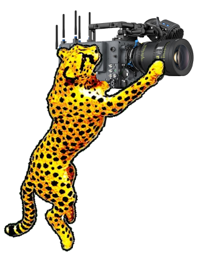
  
  # meow

  Stich two videos together to form a panorama video. For recording football games. Inspired by Veo.
  <br/><br/>

</div>

## Overview

meow is a video processing tool designed to create panoramic videos from two camera feeds, perfect for recording football games. It offers features like:

- Automatic video synchronization using audio tracks
- Video stitching to create panoramic views
- Optional video mixing mode for simpler merging
- Logo overlay capability
- YouTube upload integration
- Progress tracking and status updates
- Web-interface for easy file drop

## How to meow

<table>
<tr>
  <td align="center">
    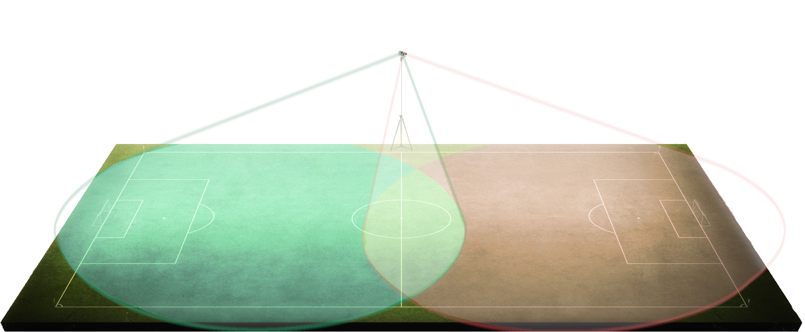<br/>
    <b>Record videos</b><br/>
  </td>
  <td align="center">
    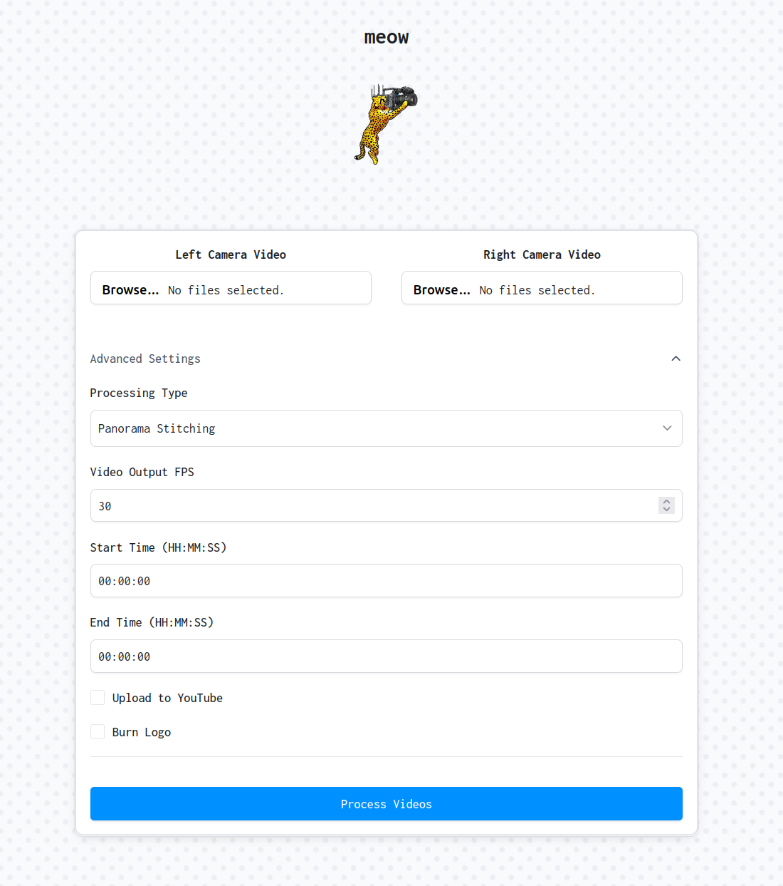<br/>
    <b>Upload files to meow</b><br/>
  </td>
  <td align="center">
    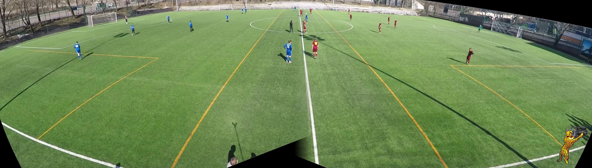<br/>
    <b>Enjoy your panorama video!</b><br/>
  </td>
</tr>
</table>

1. Requirements:
    - Two action cameras, one for each side of the field. I use Go Pro Hero 6 Blacks. Battery life and having two similar cameras is the most important thing.
    - A tripod or other stable support for the cameras, I use 7m tripod from Amazon.
    - A mount for the cameras that allows you to mount two cameras in parallel. I use cheap mount from Amazon.
2. Place the cameras in the center of the field.
3. Start the video recording on both cameras.
4. After recording, you should have two set of video files, one set for each camera.
5. Start meow and process the videos.
6. Enjoy your panorama video!


### Panorama Stitching Process


<div align="center">
  <div style="text-align: center;">
    <br/>
    <b>Meow UI</b><br/>
    <em>User interface for meow</em>
    <br/>
    <br/>
  </div>
</div>

<div align="center">

<table>
<tr>
  <td align="center">
    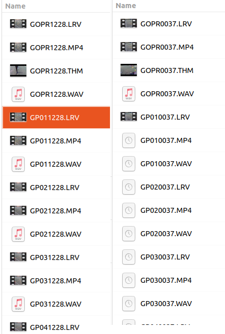<br/>
    <b>1. Sort videos</b><br/>
    <em>Sort and link videos based on similarity</em>
  </td>
  <td align="center">
    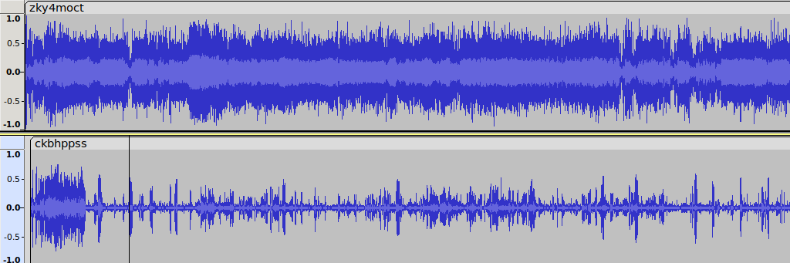<br/>
    <b>2. Sync audio</b><br/>
    <em>Extract and synchronize audio</em>
  </td>
  <td align="center">
    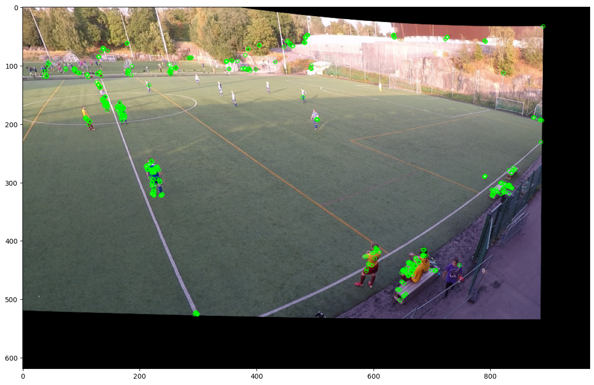<br/>
    <b>3. Keypoints detection</b><br/>
    <em>Detect distinct features from both camera feeds</em>
  </td>
  <td align="center">
    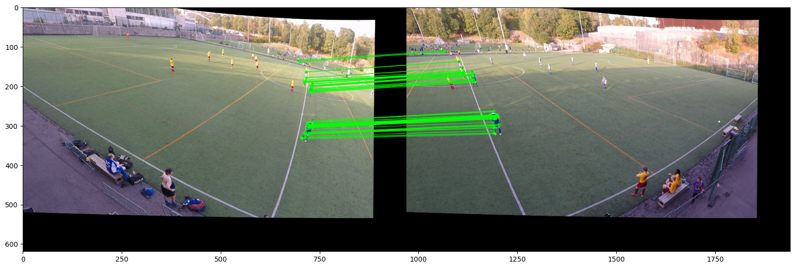<br/>
    <b>4. Keypoints matching</b><br/>
    <em>Match corresponding features between cameras</em>
  </td>
</tr>

<tr>
  <td align="center">
    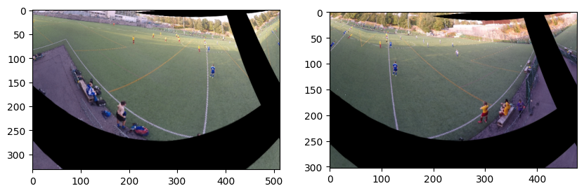<br/>
    <b>5. Warping </b><br/>
    <em>Calculate transformation matrix between views</em>
  </td>
  <td align="center">
    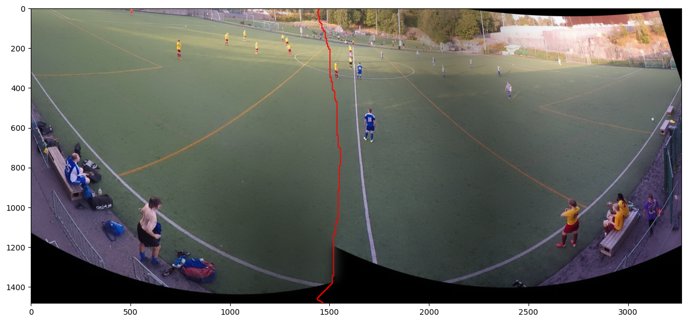<br/>
    <b>6. Blend border</b><br/>
    <em>Transform and align images</em>
  </td>
  <td align="center">
    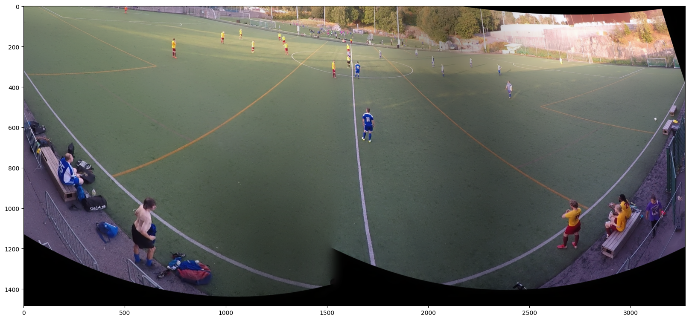<br/>
    <b>7. Blending</b><br/>
    <em>Seamlessly blend overlapping regions</em>
  </td>
  <td align="center">
    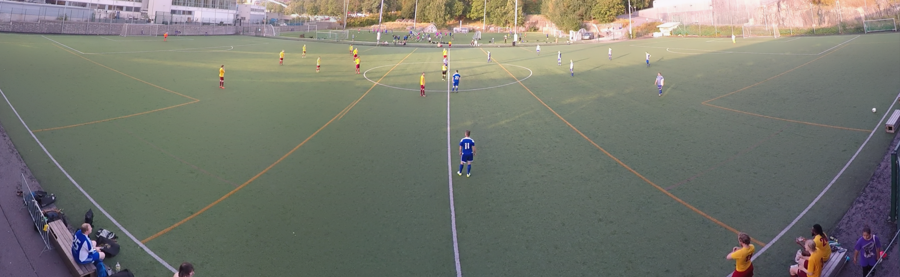<br/>
    <b>8. Final Result</b><br/>
    <em>Complete panoramic view of the field</em>
  </td>
</tr>
</table>

</div>


## Installation

1. Clone the repository:

```bash
git clone https://github.com/jakki-dev/meow.git
```

2. Install dependencies:

```bash
pip install -r requirements.txt
```

3. Build fast stitching module (required for panorama stitching, need to build as it is C++ module):

```bash
cd fast_stitching
mkdir build
cd build
cmake ..
make
```

## Usage

You can run meow either through the web interface or command line.

### Web Interface

1. Start the application:
```bash
# Using Docker
docker compose up

# Or on local machine
./run.sh
```

2. Open `http://localhost:3000` in your browser
3. Drop your video files and configure processing options
4. Click "Process Videos" to start

### Command Line

Run meow from command line:
```bash
python3 -m ml.meow.meow [options]
```

Available arguments:

| Category | Argument | Description | Default |
|----------|----------|-------------|---------|
| **Input** |
| | `-l, --left-videos` | Path to a single left camera video file | Required* |
| | `-ld, --left-directory` | Path to directory with left camera videos | Required* |
| | `-r, --right-videos` | Path to a single right camera video file | Required* |
| | `-rd, --right-directory` | Path to directory with right camera videos | Required* |
| | `-o, --output` | Path of the output video file | `meow_output.mp4` |
| **Processing Mode** |
| | `-m, --mixer` | Use video mixer mode | `False` |
| | `-p, --panorama` | Use panorama stitching mode | `False` |
| | `-mt, --mixer-type` | Mixer type: "farneback" or "abs_diff" | `farneback` |
| **Video Options** |
| | `-st, --start-time` | Start time as HH:MM:SS | Full video |
| | `-et, --end-time` | End time as HH:MM:SS | Full video |
| | `-t, --file-type` | Video file type (without dot) | `mp4` |
| | `--use-logo` | Add logo overlay | `False` |
| **Output Options** |
| | `-YT, --upload-YT` | Upload to Youtube | `False` |
| | `-s, --save` | Save intermediate files | `False` |
| | `-od, --output-directory` | Output directory path | System temp |
| **Other** |
| | `--make-sample` | Create 2-minute sample | `False` |
| | `-v, --verbose` | Show debug output | `False` |

\* Input Requirements:
- For single videos: Use `-l` and `-r`
- For multiple videos in folders: Use `-ld` and `-rd`
- Cannot mix single files and directories

Example usage:
```bash
# Process single video files with panorama stitching
python3 -m ml.meow.meow -l game_left.mp4 -r game_right.mp4 -p -o game_panorama.mp4

# Process multiple videos from directories with mixing
python3 -m ml.meow.meow -ld ./left_videos -rd ./right_videos -m -st 00:05:00 -et 01:35:00

# Create sample with logo from single files
python3 -m ml.meow.meow -l left.mp4 -r right.mp4 -p --make-sample --use-logo

# Process and upload to YouTube
python3 -m ml.meow.meow -l left.mp4 -r right.mp4 -m -YT -o "Game Highlights.mp4"

# Process with all intermediate files saved
python3 -m ml.meow.meow -l left.mp4 -r right.mp4 -p -s -od ./output_files
```

**Note**: When using directories (`-ld` and `-rd`), meow will automatically:
1. Find all video files in the directories
2. Sort them by similarity
3. Concatenate them in the correct order

When using single files (`-l` and `-r`), these steps are skipped as the videos are assumed to be complete and ready for processing.


### Flowchart of the application

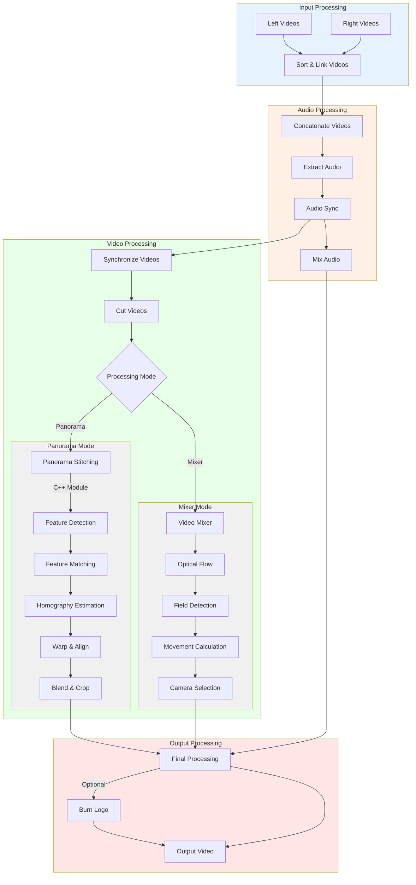


### To do

- [x] Create icon
- [x] Update README with images
- [x] Finish Synchronizer-class that determines the timecode difference between clips
- [x] Finish Stitcher-class that stitches the two synchronized clips together
- [x] Add object detector for detecting football
- [x] Add intelligent video concatenator, if clips are in multiple parts
- [x] Add web-application for file drop
- [x] Add Youtube-integration
- [x] Add documentation, so anyone else can meow also with their cameras!
- [ ] Add automated panning motion to video based on football location
- [ ] Add optional team logo overlay to video
- [ ] Add performance optimizations like parallelizing video processing
- [ ] Split meow into smaller modules like VideoProcessor, AudioProcessor, etc.
- [ ] Add configuration management
- [ ] Add automatic camera lens calibration software that can pass information to fast_stitcher
- [ ] Add better recovery handling that can pick up from where it left off