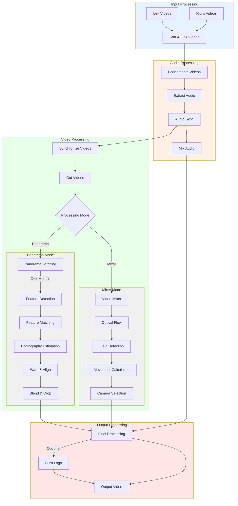

<div align="center">
  
  
  # meow

  Stich two videos together to form a panorama video. For recording football games. Inspired by Veo.
  <br/><br/>

</div>

## Overview

meow is a video processing tool designed to create panoramic videos from two camera feeds, perfect for recording football games. It offers features like:

- Automatic video synchronization using audio tracks
- Video stitching to create panoramic views
- Optional video mixing mode for simpler merging
- Logo overlay capability
- YouTube upload integration
- Progress tracking and status updates
- Web-interface for easy file drop

### Panorama Stitching Process


<div align="center">
  <div style="text-align: center;">
    <br/>
    <b>Meow UI</b><br/>
    <em>User interface for meow</em>
    <br/>
    <br/>
  </div>
</div>

<div align="center">

<table>
<tr>
  <td align="center">
    <br/>
    <b>1. Sort videos</b><br/>
    <em>Sort and link videos based on similarity</em>
  </td>
  <td align="center">
    <br/>
    <b>2. Sync audio</b><br/>
    <em>Extract and synchronize audio</em>
  </td>
  <td align="center">
    <br/>
    <b>3. Keypoints detection</b><br/>
    <em>Detect distinct features from both camera feeds</em>
  </td>
  <td align="center">
    <br/>
    <b>4. Keypoints matching</b><br/>
    <em>Match corresponding features between cameras</em>
  </td>
</tr>

<tr>
  <td align="center">
    <br/>
    <b>5. Warping </b><br/>
    <em>Calculate transformation matrix between views</em>
  </td>
  <td align="center">
    <br/>
    <b>6. Blend border</b><br/>
    <em>Transform and align images</em>
  </td>
  <td align="center">
    <br/>
    <b>7. Blending</b><br/>
    <em>Seamlessly blend overlapping regions</em>
  </td>
  <td align="center">
    <br/>
    <b>8. Final Result</b><br/>
    <em>Complete panoramic view of the field</em>
  </td>
</tr>
</table>

</div>


## Installation

1. Clone the repository:

```bash
git clone https://github.com/jakki-dev/meow.git
```

2. Install dependencies:

```bash
pip install -r requirements.txt
```

3. Build fast stitching module (required for panorama stitching, need to build as it is C++ module):

```bash
cd fast_stitching
mkdir build
cd build
cmake ..
make
```

You can either run the application from the command line or use the web-application.

3. Run the application with web-interface:

Using Docker:

```bash
docker compose up
```

or on local machine:

```bash
./run.sh
```


3. Run the application from the command line:
```bash
python3 -m ml.meow 
```

Available arguments:

| Category | Argument | Description | Default |
|----------|----------|-------------|---------|
| **Basic Arguments** |
| | `-l, --left-videos` | Path to the directory containing left camera videos | Required |
| | `-r, --right-videos` | Path to the directory containing right camera videos | Required |
| | `-o, --output` | Path of the video output file | `meow_output.mp4` |
| **Processing Options** |
| | `-m, --mixer` | Use video mixer mode (cannot be used with --panorama) | `False` |
| | `-p, --panorama` | Use panorama stitching mode (cannot be used with --mixer) | `False` |
| | `-mt, --mixer-type` | Type of mixer to use: "farneback" or "abs_diff" | `farneback` |
| **Video Timing** |
| | `-st, --start-time` | Start time of the game as HH:MM:SS | None |
| | `-et, --end-time` | End time of the game as HH:MM:SS | None |
| **Output Options** |
| | `-t, --file-type` | File type for videos without dot | `mp4` |
| | `-YT, --upload-YT` | Automatically upload to Youtube | `False` |
| | `--use-logo` | Burn logo on video | `False` |
| **Development** |
| | `-s, --save` | Save intermediate files | `False` |
| | `-od, --output-directory` | Path for the output directory | System temp |
| | `--make-sample` | Make 2-minute sample video for testing | `False` |
| | `-v, --verbose` | Verbose output for debugging | `False` |

Example usage:
```bash
# Basic panorama stitching
python3 -m ml.meow -l ./left_videos -r ./right_videos -p -o game.mp4

# Video mixing with timing
python3 -m ml.meow -l ./left_videos -r ./right_videos -m -st 00:05:00 -et 01:35:00

# Create sample panorama with logo
python3 -m ml.meow -l ./left_videos -r ./right_videos -p --make-sample --use-logo

# Full game with YouTube upload
python3 -m ml.meow -l ./left_videos -r ./right_videos -m -YT -o "Game Highlights.mp4"
```


### Flowchart of the application




### To do

- [x] Create icon
- [x] Update README with images
- [x] Finish Synchronizer-class that determines the timecode difference between clips
- [ ] Finish Stitcher-class that stitches the two synchronized clips together
- [x] Add object detector for detecting football
- [ ] Add automated panning motion to video based on football location
- [x] Add intelligent video concatenator, if clips are in multiple parts
- [x] Add web-application for file drop
- [ ] Add Youtube-integration
- [ ] Add documentation, so anyone else can meow also with their cameras!

